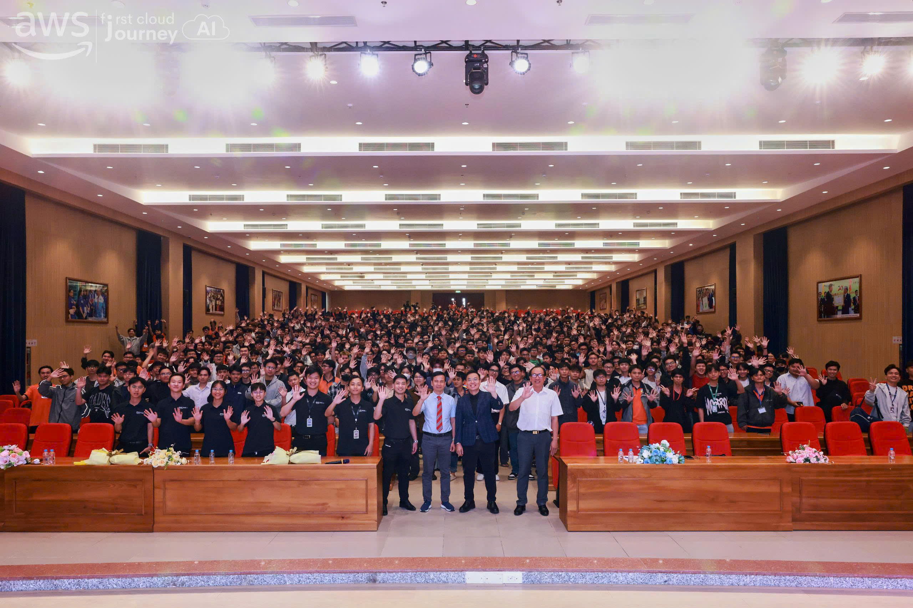

 
# Bài thu hoạch “First Cloud AI Journey – Workforce Bootcamp 2026”

### Mục Đích Của Sự Kiện

- Chia sẻ best practices: Học hỏi các tiêu chuẩn công nghiệp trong thiết kế và xây dựng ứng dụng hiện đại trên môi trường Cloud.
- Tiếp cận kiến trúc tiên tiến: Giới thiệu phương pháp DDD (Domain-Driven Design) và Event-Driven Architecture (Kiến trúc hướng sự kiện) để giải quyết các bài toán thực tế.
- Tối ưu hóa hạ tầng: Hướng dẫn lựa chọn các dịch vụ tính toán (Compute services) phù hợp trên AWS từ EC2, Containers đến Serverless.
- Ứng dụng AI đột phá: Giới thiệu và ứng dụng các công cụ Generative AI hỗ trợ toàn bộ vòng đời phát triển phần mềm (Software Development Lifecycle - SDLC).

### Danh Sách Diễn Giả

- **Nguyễn Gia Hưng** - Head of Solution Architect

### Nội Dung Nổi Bật

- **Đào tạo theo định hướng xây dựng sản phẩm thực tế trên Cloud**
- **Tiếp cận các mảng: Cloud, DevOps, Data, AI/ML**
- **Học qua hệ thống tài liệu & lab được cung cấp theo lộ trình**
- **Được hỗ trợ xuyên suốt từ cộng đồng và mentor nhưng khuyến khích tinh thần tự học là chính.**

### Những Gì Học Được

- **Nâng cao kỹ năng công nghệ theo chuẩn doanh nghiệp**
- **Xây dựng portfolio dự án thực tế**
- **Kết nối với hệ sinh thái đối tác: ITviec, VNG, Techcombank, HDBank, VIB, VPBank, Katalon, Renova Cloud,...**
- **Tham gia các sự kiện cộng đồng hàng tháng, có cơ hội trở thành speaker và phát triển lâu dài.**
- **Cơ hội trở thành:** 
AWS Community Builder 
AWS Heroes

### Định hướng nghề nghiệp

- **Sau chương trình bạn có thể phát triển theo các vị trí**
Cloud Engineer  

DevOps Engineer  

Data Engineer  

Cloud Developer  

MLOps Engineer  

#### Một số hình ảnh khi tham gia sự kiện

