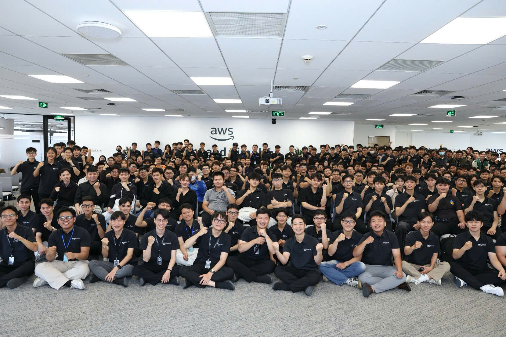

 
# Bài thu hoạch “AWS COMMUNITY DAY”

### Mục Đích Của Sự Kiện

- Kết nối cộng đồng những người đam mê công nghệ và AWS (First Cloud Journey).
- Chia sẻ phương pháp học tập hiệu quả, cách "hack" não bộ để duy trì động lực.
- Giải đáp các thắc mắc về định hướng nghề nghiệp, đặc biệt là cho sinh viên năm 3-4.
- Tạo không gian trao đổi về tư duy làm việc trong kỷ nguyên AI.

### Danh Sách Diễn Giả

- **1. Huỳnh Hoàng Long** - Addicted to learning Like You're              Addicted to Social Media
- **2. Nguyễn Tuấn Thịnh** - Automated Prompt Engineering: Enhancing LLM Output Quality
- **3. Anh Khang** - AI-Ready Freshers
- **4. Chị Thảo** - BMAD METHOD
### Nội Dung Nổi Bật

- **Hack não bộ để học tập:**
- Hiểu về cơ chế *dopamin* để biến việc học thành niềm vui như chơi game.
- Kỹ thuật chia nhỏ mục tiêu (ví dụ: chia nhỏ quãng đường chạy bộ hoặc dịch vụ AWS) để không bị ngợp.
- Sử dụng nỗi sợ bị "đứt chuỗi" (như *TikTok* hay *Duolingo*) để duy trì thói quen học hàng ngày.
- **Tư duy trong kỷ nguyên AI:**
- AI có thể giúp nhân đôi năng suất, nhưng không thể thay thế tư duy cốt lõi (foundation).
- Cảnh báo về việc lạm dụng AI khi làm *assignment* mà không hiểu bản chất (outsource tư duy là nguy hiểm).
- Nhấn mạnh tầm quan trọng của việc hiểu sâu nền tảng thay vì chỉ biết bề nổi công nghệ.

### Những Gì Học Được

- **Kỹ năng quản lý bản thân:**
- Cách xây dựng môi trường học tập (decor bàn làm việc, tạo không gian tập trung).
- Quy tắc 2 phút: Việc gì giải quyết được dưới 2 phút thì hãy làm ngay.
- **Định hướng nghề nghiệp:**
- Công thức 3 vòng tròn công việc: Yêu thích, Trách nhiệm phải làm, và Quyền lợi nhận được.
- Cách đánh giá một công việc không chỉ qua lương mà còn qua kinh nghiệm, trải nghiệm, và network.
- **Tư duy kỹ sư:**
- Tầm quan trọng của sự liêm chính (*integrity*) và nhìn dài hạn trong công việc.
- Cách xử lý các trường hợp ngoại lệ (edge cases) để làm sản phẩm chất lượng hơn.

### Ứng Dụng Vào Công Việc

- Sử dụng AI làm "trợ lý" brainstorming nhưng phải tự kiểm soát chất lượng đầu ra.
- Chú trọng vào *foundation* (nền tảng) thay vì cố gắng đuổi theo mọi công nghệ mới.
- Xây dựng thói quen làm việc nhóm và đóng góp kiến thức cho cộng đồng để tăng giá trị bản thân.

### Trải nghiệm trong event

- Không khí cởi mở, khuyến khích các bạn trẻ đặt câu hỏi và phản biện trực tiếp.
- Môi trường học hỏi thực tế qua các ví dụ đời thường, không khô khan.
- Cơ hội kết nối với những người cùng chí hướng trong cộng đồng *First Cloud Journey*.

#### Một số hình ảnh khi tham gia sự kiện

